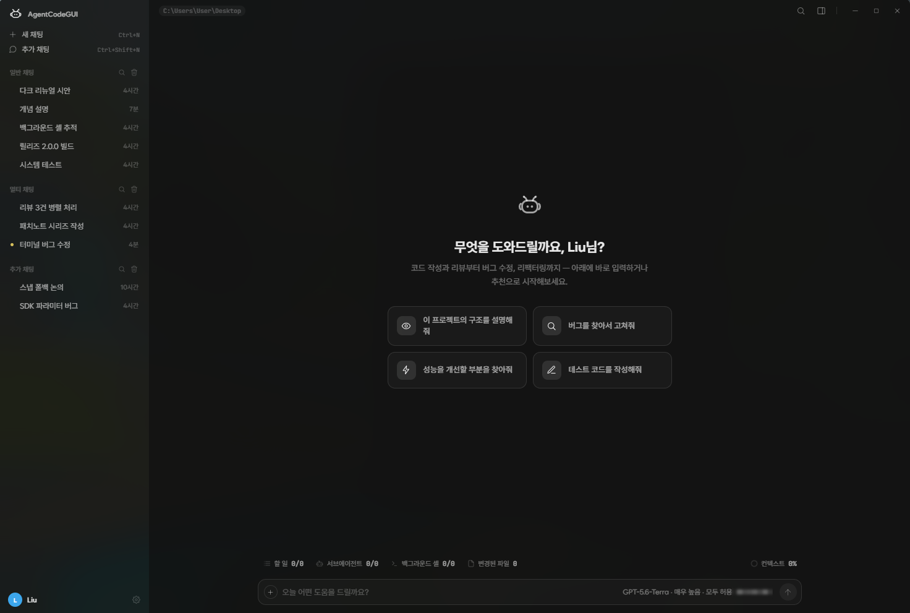
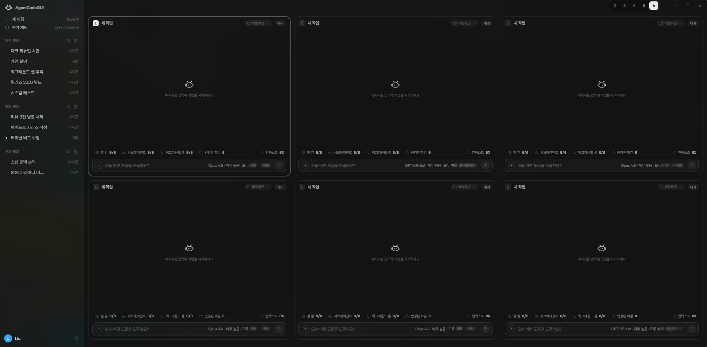
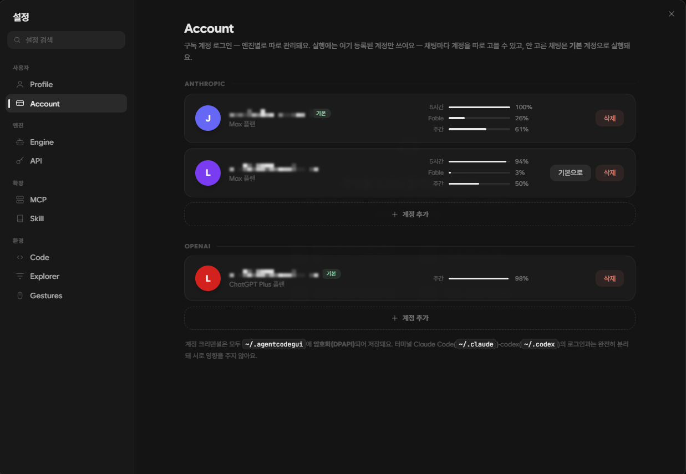

<div align="center">

# AgentCodeGUI

**Claude Code와 Codex CLI를 위한 올인원 에이전트 앱**

대화로 코딩하고, 그 자리에서 읽고 고칩니다.

[](https://github.com/UnrealFactory/AgentCodeGUI/releases/latest)
[](https://github.com/UnrealFactory/AgentCodeGUI/releases)






</div>

## Overview

AgentCodeGUI는 터미널의 코딩 에이전트(**Claude Code** · **Codex CLI**)를 하나의 데스크탑 앱으로 옮긴 Windows 앱입니다. 채팅으로 작업을 시키고, 에이전트가 만진 코드를 **내장 탐색기와 LSP 코드 뷰어**로 그 자리에서 읽고, 여러 에이전트를 **나란히** 돌립니다.

- **API 키 없이 시작** — Claude / ChatGPT 구독 계정으로 앱 안에서 로그인해 그대로 실행해요. API 키(종량)도 선택할 수 있습니다.
- **설치는 한 번** — 엔진(Claude Code · Codex CLI)은 앱이 알아서 설치·업데이트하고, 시스템에 설치된 터미널 환경은 건드리지 않아요.
- **Windows 11 아크릴 위 플랫 다크 디자인** — 한국어 UI.

## Features

**대화 · 에이전트**

- 스트리밍 응답 · 도구 호출 로그 · 승인/질문 카드(답한 문답은 대화에 흔적으로) · 실행 중 메시지 예약
- 서브에이전트 카드 — 실시간 내레이션과 과정 로그 · 백그라운드 셸 추적(라이브 출력·중지·`Ctrl+B` 건너뛰기)
- 작업 바 — 할 일 · 서브에이전트 · 백그라운드 셸 · 변경된 파일 · 컨텍스트 게이지가 한 줄에
- `Ctrl+F` 대화 검색 · 이미지/텍스트 파일 첨부 · `/` 명령·스킬 · `@` 파일 멘션 · `↑`/`↓` 보낸 메시지 복구
- 우클릭 드래그 **마우스 제스처** — 스크롤·이전/다음 파일·창 제어·대화 비우기까지 손짓으로

**멀티 · 추가 채팅**

- 최대 6개 패널이 각자 **폴더·모델·계정**으로 동시 작업 — 속은 본채팅 그대로(컴포저·작업 바·승인 카드)
- **추가 채팅**(`Ctrl+Shift+N`) — 코드 작업 옆에 띄우는 독립 OS 창, 대화는 닫아도 저장되고 재시작하면 복원

**코드 인텔리전스**

- 내장 탐색기 + LSP 코드 뷰어 — **TS/JS · Python · C#(솔루션째) · C/C++ · 언리얼 Verse**
- `F12` 정의 이동 · 시맨틱 색칠(JetBrains 팔레트) · 구조화 호버 카드 · 종류별 아이콘 자동완성
- 공식 API 문서 **한국어 번역 호버**(언리얼 C++ · Verse) · C#은 어셈블리 심볼도 `F12`로 디컴파일 소스까지
- diff 뷰어(추가=초록 행 · 삭제=빨간 고스트 줄) · **HTML은 열자마자 렌더 미리보기** · 마크다운 렌더
- 에이전트가 만진 파일은 색·배지로, 폴더 우클릭 → **변경된 파일 모아보기**

**계정 · 과금**

- 구독 계정을 **엔진별로 여러 개 등록**, 채팅마다 실행 계정 바인딩 — 계정마다 **남은 한도 게이지**(5시간·주간·Fable)
- 실행마다 **구독(정액) ↔ API 키(종량)** 선택 — API는 예산·비용 추적, 키는 암호화(DPAPI) 저장

## Supported AI Models

| 엔진 | 모델 | 과금 |
|---|---|---|
| **Claude Code** (Anthropic) | Fable 5 · Opus 4.8 · Sonnet 5 · Haiku 4.5 | Claude 구독(Pro/Max) 또는 API 키 |
| **Codex CLI** (OpenAI) | GPT-5.6-Sol · GPT-5.6-Terra · GPT-5.6-Luna | ChatGPT 구독(Plus/Pro) 또는 API 키 |

모델 목록은 설치된 엔진에서 실시간으로 불러와 — 새 모델이 나오면 picker에 자동으로 뜹니다. 엔진·모델·추론 강도·권한 모드는 컴포저에서 채팅마다 따로 골라요.

## Accounts

<div align="center">

</div>

설정 → **Account**에서 구독 계정을 엔진별로 등록·관리합니다 — Anthropic·OpenAI 각각 **여러 개**를 등록해두고, 채팅마다 실행 계정을 골라 쓸 수 있어요(안 고르면 **기본** 계정). 계정마다 **남은 한도**(5시간·주간·Fable)가 게이지로 붙어 여유 있는 쪽으로 갈아탑니다.

계정 크리덴셜은 전부 `~/.agentcodegui`에 암호화(DPAPI) 저장되고, 터미널 Claude Code(`~/.claude`)·codex(`~/.codex`)의 로그인과는 **완전히 분리**돼 서로 영향을 주지 않아요.

## Installation

1. [**Releases**](https://github.com/UnrealFactory/AgentCodeGUI/releases/latest)에서 `AgentCodeGUI-Setup-<버전>.exe`를 받아 실행합니다.
2. 코드 서명이 없어 SmartScreen 경고가 뜨면 **"추가 정보 → 실행"** 으로 넘어갑니다.
3. 첫 실행에 엔진이 자동으로 설치됩니다. 설정 → **Account**에서 구독 계정으로 로그인하면(또는 설정 → **API**에 키 등록) 바로 시작이에요.

- 요구 사항: **Windows 10/11**
- 새 버전은 **자동 업데이트** — 사이드바에 배지가 뜨면 클릭 한 번으로 조용히 설치됩니다.
- 폴더 우클릭 → **"AgentCodeGUI로 열기"** 로 그 폴더를 작업 폴더 삼아 바로 엽니다.

## Development

```bash
npm install          # 의존성 설치
npm run dev          # electron-vite dev (HMR)
npm run typecheck    # tsc — main(node) + renderer(web)
npm run package      # NSIS 설치 파일(.exe) 빌드
npm run release      # 빌드 + GitHub Releases 게시 (GH_TOKEN 필요)
```

```
src/main      Electron 메인 — claude/ · codex/ 엔진 어댑터, lsp/, 영속화(~/.agentcodegui)
src/renderer  React UI — components/, store/session.ts(EngineEvent 리듀서)
src/shared    IPC 프로토콜·타입 (main ↔ renderer 계약)
```
