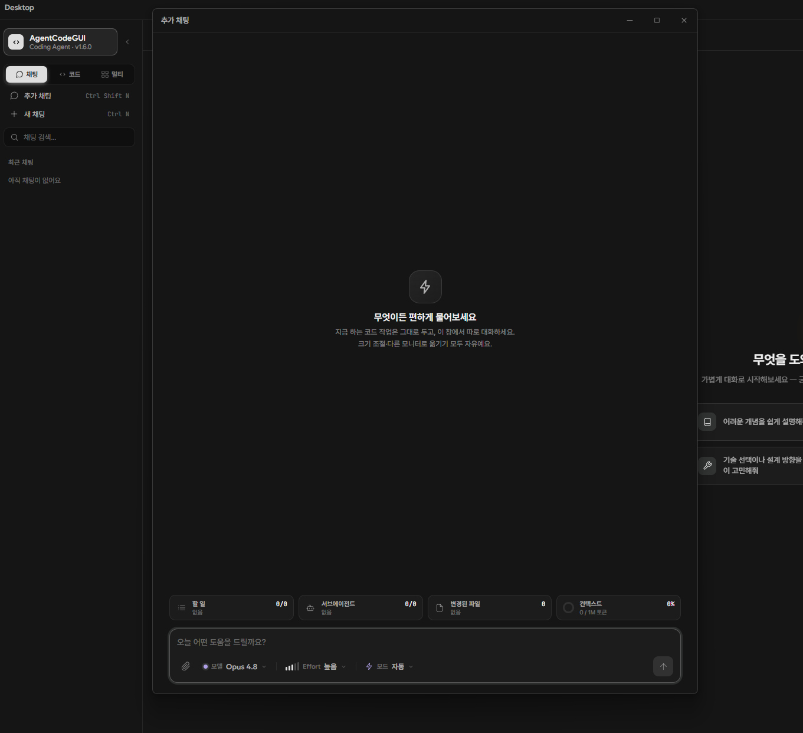
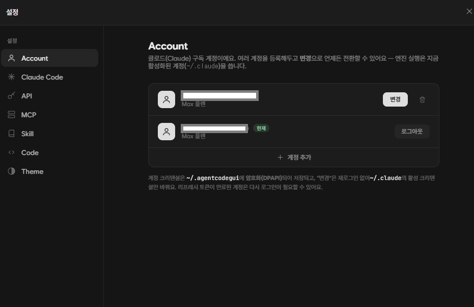
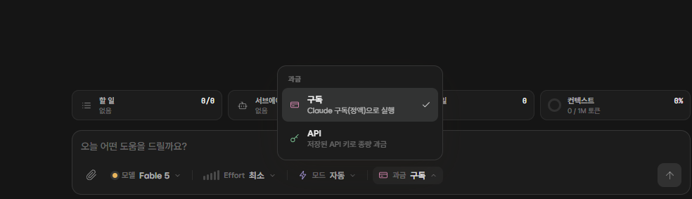
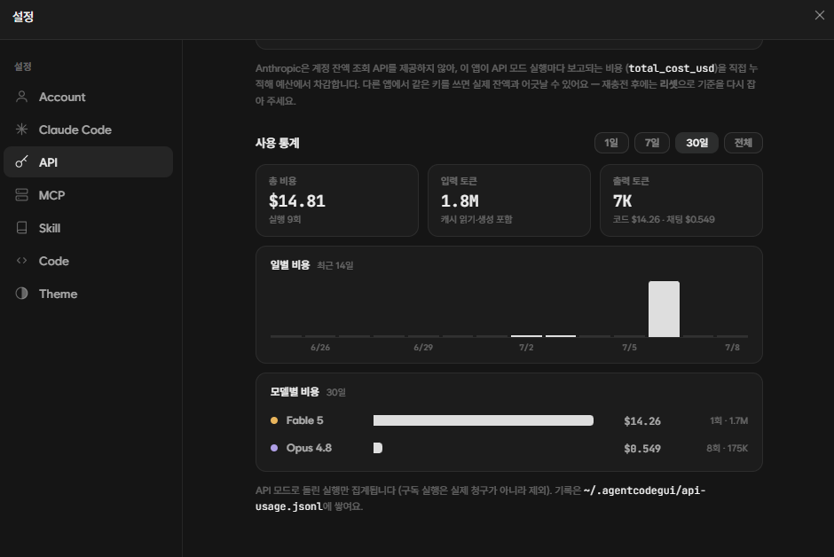
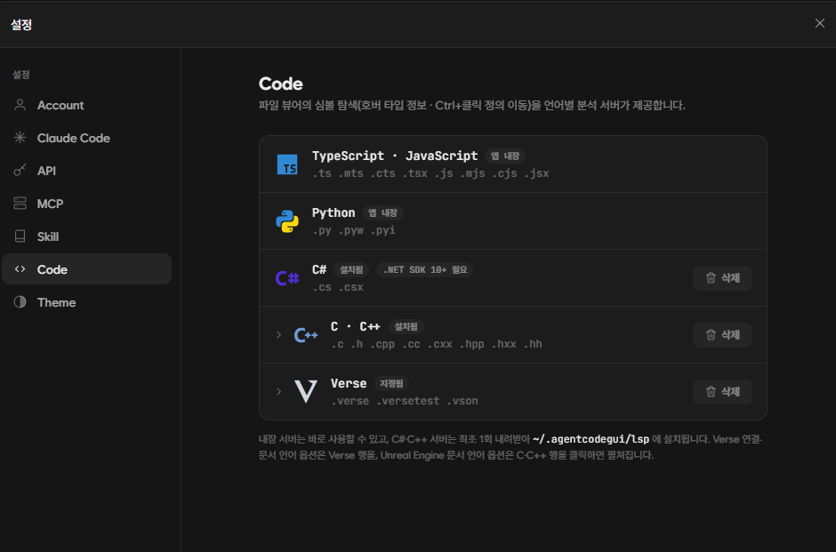

<div align="center">

# AgentCodeGUI

**대화로 코딩하고, 그 자리에서 코드를 읽고, Git까지 — Claude Code를 위한 데스크탑 IDE**


</div>

로컬에 설치된 **Claude Code를 풀 에이전트 모드로 구동**하는 Electron 데스크탑 앱입니다.
채팅·에이전트 대시보드에 **자체 파일 탐색기와 LSP 코드 인텔리전스**, **Git 통합**, **멀티
에이전트**를 얹어, 별도 에디터 없이 한 화면에서 *대화 → 코드 읽기 → 검증 → 커밋*까지 이어집니다.

- 🔑 **API 키 불필요** — 이 PC의 Claude Code 로그인(OAuth)을 그대로 재사용, **앱 안에서 계정 로그인·전환**(여러 계정 등록)
- 💳 **구독 ↔ API 자유** — 실행마다 구독(정액) / 저장된 API 키(종량)를 전환, 사용량·예산 표시
- 💬 **추가 채팅** — 코드 작업은 그대로 두고 독립 창(크기 조절·다른 모니터)에서 따로 물어보기(`Ctrl+Shift+N`)
- ⚙️ **엔진까지 앱 안에서** — 첫 실행에 최신 Claude Code 엔진을 자동 설치, 시스템 Claude는 그대로
- 💾 대화·변경 파일·diff·쓰다 만 초안까지 **전부 영속화** — 껐다 켜도 그 자리에서 계속
- 🪟 Windows 10/11 · 한국어 UI · 라이트/다크 테마

---

## 한눈에 보기

### 하나의 창에 전부 — 탐색기 · 대화 · 에이전트

| 다크 테마 | 라이트 테마 |
|:---:|:---:|
|  |  |

왼쪽 **파일 탐색기**, 가운데 **대화**(스트리밍 응답·사고 표시·도구 호출 로그·Bash 출력 인라인),
오른쪽 **에이전트 패널**(할 일 진행률·서브에이전트·**변경된 파일**). AI가 만진 파일은 탐색기에서
색·배지로 바로 드러나고, 변경된 파일을 누르면 그대로 diff로 열립니다. **라이트·다크 테마를 모두
지원**해요 — 설정에서 전환합니다.

### Git 통합 — ⎇ 한 장의 카드로


탐색기 **⎇ 버튼** 하나로 Fork식 3분할 **Git 카드**가 열립니다 — 왼쪽 작업 트리·히스토리·브랜치/
태그, 가운데 커밋 목록(메시지·해시·작성자 검색), 오른쪽 커밋 상세와 변경 파일. 변경을 읽어
**Claude가 커밋 메시지를 작성**하고, **푸시·당겨오기**도 카드 안에서. `.git`이 상위 폴더에 있어도
알아서 찾아냅니다.

### 멀티 에이전트 — 여럿이 동시에


N개의 패널이 각자 **폴더·프롬프트·모델**로 동시에 작업합니다. 실행 중에도 다음 메시지를
**예약**해 두면 끝나는 대로 순차 전송, 세션 단위 작업 목록으로 전체 진행이 한눈에.

### 추가 채팅 — 코드 옆, 독립 대화 창



사이드바 **추가 채팅**(또는 `Ctrl+Shift+N`)으로 지금 하던 코드 작업은 그대로 두고 **독립된 대화
창**을 하나 더 띄웁니다 — **크기 조절·다른 모니터로 옮기기 자유**, 창마다 완전히 독립된 세션.
모델·첨부는 물론 **할 일·서브에이전트·변경 파일·컨텍스트**까지 본 채팅과 똑같이 갖췄어요.
그리고 어느 채팅에서든 **`Ctrl+F`로 대화 내용을 검색**합니다(다음/이전 이동·현재 위치 강조).

### 계정 · 과금 — 여러 계정, 구독 ↔ API

| 클로드 계정(로그인·전환) | 과금 선택(구독 ↔ API) |
|:---:|:---:|
|  |  |

설정 **Account** 탭에서 **여러 클로드 구독 계정을 등록**해두고 **변경**으로 언제든 전환합니다 —
로그인은 브라우저 OAuth, 계정 크리덴셜은 암호화(DPAPI)되어 저장돼요. 컴포저의 **과금 토글**로는
실행마다 **구독(정액) ↔ 저장된 API 키(종량)** 를 오가고(멀티는 패널별), API 모드에선 5시간·주간
한도 대신 **사용 비용·남은 예산**과 모델·일자별 **사용 통계**가 설정 → API에 표시됩니다.



### 코드 인텔리전스 — 에디터 없이 코드를 읽다


LSP 기반 코드 뷰어 — 구문 강조, 심볼 호버 타입 정보, `F12`·`Ctrl+클릭` **정의로 이동**,
`Ctrl+F` 파일 내 검색. 언어별 **JetBrains 색 스킴**(C/C++·C#은 Rider, 그 외는 IntelliJ)을
자동으로 적용합니다. 언리얼 **Verse**는 정의 이동·구조화 호버 카드·멤버 자동완성까지 지원하고,
**공식 API 문서(`/Verse.org`·`/UnrealEngine.com`·`/Fortnite.com`) 주석을 호버에서 한국어로**
보여줍니다 — 설정에서 원문↔한국어로 전환할 수 있어요.

### 드래그 → 복사 · Claude에게 질문


코드를 드래그하면 떠오르는 툴바로 **복사**하거나, 선택한 부분을 그대로 **"Claude에게 질문"**
으로 보냅니다. 작성칸에서는 `↑`/`↓`로 보낸 메시지를 셸처럼 다시 불러올 수 있고 — 단일·멀티
모드 어디서나 똑같이 동작합니다.

### 서브에이전트 들여다보기


에이전트가 띄운 서브에이전트의 **역할·도구 호출·결과**를 카드로 펼쳐 봅니다.

### 엔진까지 앱 안에서


**첫 실행에 최신 Claude Code 엔진을 자동으로 받아 설치**(원클릭)하고 바로 활성화 — 별도 설정 없이
시작합니다. 새 버전이 나오면 업데이트를 안내하고, 설정에서 원하는 버전으로 **설치·전환**할 수
있어요. 전부 `~/.agentcodegui` 안에서 처리돼 **시스템에 설치된 Claude는 건드리지 않습니다.**
스킬 / MCP 서버 관리, 로컬 프로필, 테마도 이 설정 안에서.

---

## 다운로드 & 설치

릴리스에서 설치 파일 하나만 받으면 됩니다 — 빌드도, 복잡한 설정도 필요 없어요.

**1. 저장소 오른쪽 `Releases`에서 최신 버전을 엽니다.**


**2. `Assets`에서 `AgentCodeGUI-Setup-<버전>.exe`를 받아 실행합니다.**


설치 마법사(설치 위치 선택·바로가기 생성)를 따라가면 끝납니다. 코드 서명이 없어 첫 실행 때
Windows SmartScreen 경고가 뜰 수 있는데, **"추가 정보 → 실행"**으로 넘어가면 돼요. 이후 새
버전은 앱이 실행 중 **자동으로 업데이트**합니다.

> 실행하려면 이 PC에 [Claude Code](https://claude.com/claude-code)가 설치·로그인돼 있어야
> 합니다(앱이 그 OAuth 로그인을 그대로 재사용). 엔진 자체는 첫 실행에 앱이 자동으로 받아옵니다.

---

## 주요 기능

### 채팅 · 에이전트
- 스트리밍 응답, 사고(thinking) 표시, 도구 호출 로그(접힘/펼침), Bash 출력 인라인 표시
- 에이전트 패널: 할 일 진행률 · 서브에이전트 현황 · **변경된 파일**(+/− 줄 수, 클릭 → diff)
- 권한/질문 카드(허용·항상 허용·거부, AskUserQuestion 응답), 실행 중 메시지 **예약 큐**
- 모델(Fable/Opus/Sonnet/Haiku) · 사고 강도(effort) · 권한 모드 픽커 — 채팅별 기억
- 작성칸에서 `↑`/`↓`로 **보낸 메시지 히스토리 복구**, 드래그 선택 시 **복사 / 더 자세히** 툴바
- **`Ctrl+F` 대화 내 검색** — 일치 강조·다음/이전 이동(단일·채팅·멀티 어디서나, 스트리밍 중에도)
- 컨텍스트 게이지(현재/윈도우 토큰), 5시간·주간 사용량 표시
- `/init` `/compact` `/review` `/security-review` 슬래시 명령 → 진행/완료 카드
- **추가 채팅**(`Ctrl+Shift+N`) — 코드 작업과 분리된 독립 OS 창(크기 조절·다른 모니터), 자체 세션·WorkBar·첨부
- `/ask` — 본 대화를 오염시키지 않는 일회용 사이드 질문 창(**파일 첨부** 지원)
- 이미지·텍스트 파일 첨부(붙여넣기·드래그·선택기) + 라이트박스 뷰어
- **멀티 에이전트 모드** — 여러 작업 패널을 나란히 두고 동시 진행(패널별 예약·복사·히스토리 포함)

### 계정 · 과금
- **클로드 계정**(설정 → Account): **여러 구독 계정 등록·전환**, 브라우저 OAuth 로그인/로그아웃,
  계정 크리덴셜은 암호화(DPAPI)로 `~/.agentcodegui`에 저장
- **과금 토글**(컴포저): 실행마다 **구독(정액) ↔ 저장된 API 키(종량)** 전환 — 멀티는 패널별
- API 모드 실행의 **비용·남은 예산** 표시 + 설정 → API에 모델·일자별 **사용 통계**

### Git 통합
- 탐색기 **⎇ 버튼** → Fork식 3분할 **Git 카드**: 커밋 히스토리 · 변경 사항 · 브랜치/태그
- 파란 점으로 미푸시 커밋, 릴리스 태그 칩·날짜 그룹, 메시지·해시·작성자 검색
- 변경을 읽어 **Claude가 커밋 메시지 작성** → 바로 커밋, **푸시·당겨오기**도 카드 안에서
- `.git`이 상위 폴더에 있어도 자동으로 찾아냄

### 자체 IDE (탐색기 + 뷰어)
- **파일 탐색기**: lazy 트리, 파일 검색(`Ctrl+F`), AI가 만진 파일 색·배지 표시
  (수정 `M` 노랑 · 새 파일 `N` 초록, 변경 품은 폴더는 점), 펼친 폴더 작업폴더별 기억,
  **참고 폴더**(보기 전용 폴더를 추가해 메인↔참고 전환)
- **파일 뷰어**: 구문 강조 + LSP 코드 인텔리전스(호버 타입 정보 · `F12`/`Ctrl+클릭` 정의 이동 ·
  시맨틱 토큰), **파일 내 검색**(`Ctrl+F`), **드래그 선택 → "Claude에게 질문"**,
  이미지 미리보기(png/jpg/svg…, 체커보드·핏·줌), **마크다운 렌더 보기**(변경된 md는 렌더가 기본,
  `Ctrl+D`로 렌더 ↔ 변경(diff) 소스 전환)
- **Diff 뷰어**: 코드 뷰어에 통합 — 전체 파일 맥락 위 변경 표시, **삭제된 줄은 빨간 고스트 줄**
  (옛 줄 번호 유지), 오버뷰 룰러(클릭 점프), 커밋 시점의 파일 그대로 열람
- **JetBrains 색 스킴**: 언어별 자동 적용 — C#·C++ 계열은 Rider(ReSharper) 팔레트,
  그 외(TS/Python/…)는 IntelliJ 공식 스킴(라이트=IntelliJ Light, 다크=New UI Dark)
- 모든 카드 공통: `Ctrl+휠` 줌, 크기 조절·최대화(상태 기억), `Esc` 닫기

### LSP 코드 인텔리전스



- 프로젝트별 언어 서버를 **첫 파일을 열 때 lazy 구동** — 안 쓰면 비용 0
- 번들: TypeScript/JavaScript · Python(pyright) — Electron 내장 Node로 즉시 실행
- 다운로드: C#(OmniSharp) · C++(clangd) — 필요할 때 "심볼 분석 설치" 한 번으로 받음
  (언리얼 프로젝트는 clangd 컴파일 DB 자동 생성 시도)
- **Verse(언리얼)**: Epic `verse-lsp` 연동 — 정의 이동 · 구조화 호버 카드 · 멤버 자동완성,
  선언 위치 호버(네이티브·확장 메서드, `@속성`)와 **공식 API 주석 한국어 호버**
  (`/Verse.org`·`/UnrealEngine.com`·`/Fortnite.com`, 설정에서 원문↔한국어 전환)
- 크래시 쿨다운·문서 수 제한·프로세스 트리 정리 등 수명 관리 내장

### 환경
- 스킬 / MCP 서버 관리(켜기·끄기), 로컬 프로필(닉네임·색), 한국어 UI, 라이트/다크 테마
- 엔진(Claude Code) — **첫 실행에 최신 버전 자동 설치**, 인앱 업데이트·버전 전환
- 단축키: `Ctrl+N` 새 채팅 · `Ctrl+O` 폴더 열기 · `Ctrl+F` 검색(탐색기/파일 내) ·
  `` ` `` 사이드바 접기 · `Shift+Tab` 권한 모드 순환 · `Esc` 실행 중지/카드 닫기

## 요구 사항

- Windows 10/11
- [Claude Code](https://claude.com/claude-code) 설치 + 로그인 (`claude --version` 확인)
  — Agent SDK가 그 OAuth 세션을 그대로 사용한다

## 개발

```bash
npm install          # 의존성 설치 (또는 install.bat)
npm run dev          # electron-vite dev, HMR (또는 dev.bat)
npm run typecheck    # tsc — main(node) + renderer(web)
npm run build        # 프로덕션 번들 (out/)
npm run preview      # 빌드 결과물로 앱 실행
npm run gen-icon     # 앱 아이콘 + 설치 마법사 아트 재생성
npm run package      # NSIS 설치 파일(.exe) 빌드 (또는 make-exe.bat)
npm run release      # 빌드 + GitHub Releases 게시 (또는 release.bat)
```

### 프로젝트 구조

```
src/
├─ main/                 # Electron 메인 프로세스
│  ├─ claude/engine.ts   #   Agent SDK query() 스트리밍 → EngineEvent
│  ├─ lsp/               #   언어 서버 매니저(stdio JSON-RPC)·설치
│  ├─ engine/versions.ts #   Claude Code 엔진 버전 설치/전환
│  ├─ chats.ts maStore.ts uiPrefs.ts profile.ts  # 영속화(~/.agentcodegui)
│  └─ files.ts skills.ts mcp.ts updater.ts
├─ preload/              # contextBridge → window.api
├─ renderer/src/
│  ├─ components/        # Chat · Explorer · FileModal · GitModal · MultiAgent …
│  ├─ store/session.ts   # EngineEvent 리듀서 (메시지·도구·diff·서브에이전트)
│  └─ lib/               # prefs · highlight · theme · mentions …
└─ shared/               # IPC 프로토콜 · 타입 (main ↔ renderer 계약)
```

## 배포 · 설치 · 자동 업데이트

### 설치 파일

`npm run package` → `dist\AgentCodeGUI-Setup-<버전>.exe`. 앱 톤으로 꾸민 NSIS
설치 마법사(위치 선택 · 진행 로그 · 바로가기 생성)가 뜬다. 코드 서명이 없어 첫 실행 때
SmartScreen 경고가 뜰 수 있다("추가 정보 → 실행").

> **빌드 머신 주의:** electron-builder가 `winCodeSign`을 풀 때 심볼릭 링크를 만든다.
> 관리자 권한으로 빌드하거나 Windows **개발자 모드**를 켜두면 일반 권한으로도 빌드된다.

### 우클릭 "AgentCodeGUI로 열기"

설치 시 탐색기 컨텍스트 메뉴(HKCU)가 등록된다. 폴더(또는 폴더 안 빈 공간) 우클릭 →
"AgentCodeGUI로 열기" → 그 폴더가 작업 폴더로 설정된 채 열린다. 이미 실행 중이면
기존 창이 그 폴더로 전환된다(단일 인스턴스). Windows 11에선 "더 많은 옵션 표시" 아래에 보인다.

### 자동 업데이트

`electron-updater`가 GitHub Releases(`UnrealFactory/AgentCodeGUI`)를 본다. 실행 시
새 버전 확인 → 백그라운드 다운로드 → "재시작하여 설치" 배너, 안 눌러도 다음 종료 때 설치.
업데이트 후 첫 실행에는 변경 사항(What's New) 카드가 뜬다.

새 버전 내보내기:

```bash
# 1) package.json "version" 올리기 (예: 1.0.0 → 1.0.1)
set GH_TOKEN=ghp_xxxxxxxxxxxx   # repo 쓰기 권한
npm run release                  # 또는 release.bat
```
</content>
</invoke>
