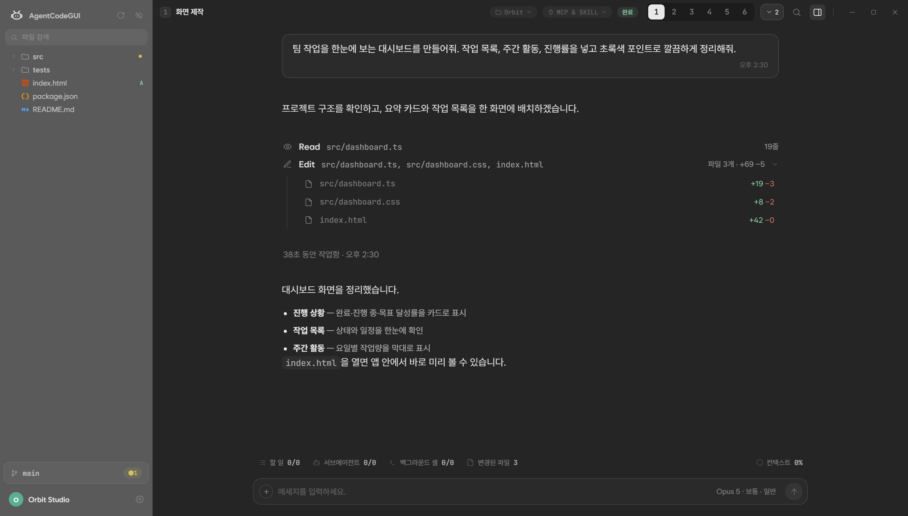
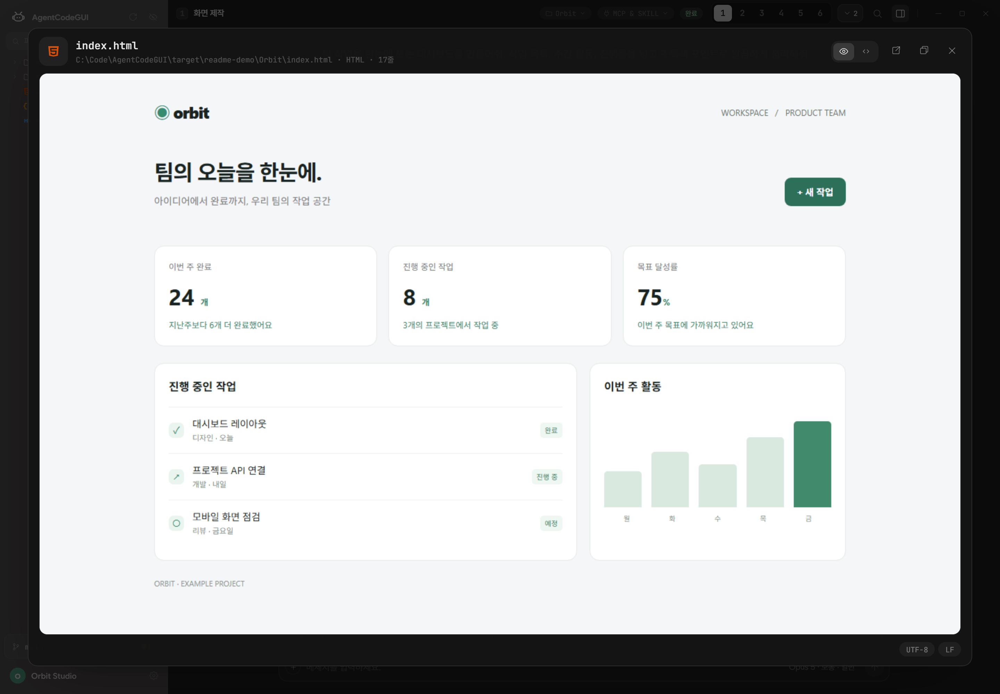
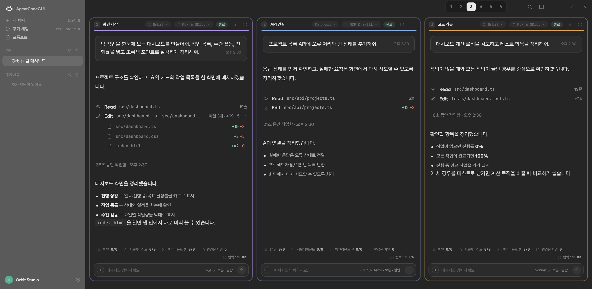

<div align="center">

# AgentCodeGUI

### 말로 만들고, 코드로 확인하세요.

**Claude Code와 Codex를 한곳에서 쓰는 Windows 데스크톱 앱**

대화로 작업을 맡기고, 바뀐 파일을 확인하고, 여러 에이전트를 나란히 실행하세요.

**한국어** · [English](README.en.md)

[](https://github.com/UnrealFactory/AgentCodeGUI/releases/latest)
[](https://github.com/UnrealFactory/AgentCodeGUI/releases)
[](https://github.com/UnrealFactory/AgentCodeGUI/stargazers)


[**Windows용 다운로드 →**](https://github.com/UnrealFactory/AgentCodeGUI/releases/latest) · [업데이트 소식](https://github.com/UnrealFactory/AgentCodeGUI/releases) · [버그 제보 · 기능 제안](https://github.com/UnrealFactory/AgentCodeGUI/issues)



<sub>3.0.10 실제 앱 화면 · 소개용 예제 프로젝트 Orbit</sub>

</div>

## 작업의 시작부터 확인까지, 한 화면에서

AgentCodeGUI는 터미널 코딩 에이전트에 **대화·파일 탐색·코드 확인·Git**을 더한 앱입니다. 익숙한 Claude Code와 Codex를 사용하면서, 에이전트가 무엇을 바꿨는지 눈으로 따라갈 수 있습니다.

| 하고 싶은 일 | 앱에서 바로 |
|---|---|
| 원하는 기능 만들기 | 대화로 요청하고, 도구 실행과 답변을 실시간으로 확인 |
| 바뀐 코드 검토하기 | Edit 목록에서 파일을 골라 열고 추가·삭제 내용 비교 |
| 여러 작업 나눠 하기 | 최대 6개 패널에서 폴더·모델·계정을 각각 선택 |
| 내 도구 연결하기 | Claude·Codex의 MCP와 스킬 확인, 로컬·전역 필터 |
| 작업 마무리하기 | 변경 파일 선택, 커밋 메시지 작성, 커밋·Pull·Push |

## 01. 요청하고, 바뀐 파일을 바로 열어보세요

답변과 도구 기록이 같은 대화에 남습니다. 여러 파일을 수정한 **Edit 행은 펼쳐서** 파일별로 열 수 있고, 추가·삭제 줄 수도 함께 표시됩니다.

- **파일 탐색기와 코드 뷰어** — 검색, 코드 편집, 변경 내용 비교
- **코드 인텔리전스** — 정의로 이동(`F12`), 호버 설명, 자동완성
- **미리보기** — HTML은 렌더링된 화면으로, Markdown은 문서로 확인



<sub>파일을 클릭해 결과 화면까지 확인하는 흐름. 화면 속 대시보드는 예제 프로젝트입니다.</sub>

## 02. Claude와 Codex를 나란히 쓰세요

한쪽에서는 화면을 만들고, 다른 쪽에서는 API를 연결하거나 코드를 검토하세요. **최대 6개 패널**에 서로 다른 작업 폴더·모델·계정을 지정할 수 있습니다.



- 패널 수를 바꾸고, 드래그해서 원하는 순서로 배치
- 별도 채팅 창(`Ctrl+Shift+N`)을 열어 다른 작업 옆에 두기
- 할 일·하위 에이전트·백그라운드 명령·변경 파일을 작업 바에서 확인
- Claude 워크플로의 단계와 에이전트별 진행 상황 확인

## 03. 쓰던 계정과 도구로 시작하세요

| 엔진 | 연결 방법 | 대화별 설정 |
|---|---|---|
| **Claude Code** · Anthropic | Claude 구독 계정 또는 API 키 | 모델·추론 강도·권한 모드 |
| **Codex CLI** · OpenAI | ChatGPT 구독 계정 또는 API 키 | 모델·추론 강도·지원 모델의 속도 옵션 |

엔진은 앱에서 설치하고 업데이트합니다. 여러 계정을 등록해 대화별로 선택하고, 남은 사용 한도를 확인할 수 있습니다.

**MCP & Skill**에서 선택한 엔진의 도구를 확인하세요. 로컬·전역 필터로 목록을 좁히고, 지원되는 항목은 켜거나 끌 수 있습니다. 스킬은 Claude의 `/`, Codex의 `$` 자동완성으로 입력합니다. Codex 설정 변경은 다음 실행에 반영됩니다.

## 작은 기능도 놓치지 않았습니다

| 대화 | 코드와 작업 공간 |
|---|---|
| 이미지·텍스트 첨부, `@` 파일 참조 | TypeScript·JavaScript·Python·C#·C/C++ 코드 인텔리전스 |
| `Ctrl+F` 대화 검색, 보낸 메시지 다시 불러오기 | HTML·Markdown 미리보기와 변경 내용 비교 |
| 승인·질문 카드와 메시지 예약 | Git 변경 파일 선택, 기록, 브랜치 전환·생성 |
| 마우스 제스처와 한국어·영어 UI | 폴더 우클릭으로 작업 공간 열기 |

## 설치하기

1. [**최신 릴리스**](https://github.com/UnrealFactory/AgentCodeGUI/releases/latest)에서 `AgentCodeGUI3_<버전>_x64-setup.exe`를 내려받아 실행합니다.
2. 앱에서 엔진 설치를 완료합니다.
3. **Settings → Account**에서 계정으로 로그인하거나, **API**에서 키를 연결합니다.
4. 작업 폴더를 고르고 첫 메시지를 보내세요.

**Windows 10/11 · x64**를 지원합니다. 이후 업데이트는 앱의 **Settings → Updates**에서 확인하고 설치할 수 있습니다.

<details>
<summary>설치 시 Windows SmartScreen 안내가 표시된다면</summary>

현재 배포 파일에는 Windows 코드 서명 인증서가 적용되어 있지 않습니다. 공식 릴리스에서 받은 파일인지 확인한 뒤 **추가 정보 → 실행**으로 설치할 수 있습니다. 앱 내 자동 업데이트는 별도의 업데이트 서명으로 검증합니다.

</details>

## 개발하기

3.x는 **Tauri 2 · Rust · React · TypeScript**로 구성됩니다. Node.js 22 이상, Rust 및 Windows C++ 빌드 도구가 필요합니다.

```bash
npm install
npm run tauri:dev              # 개발 앱 실행
npm run typecheck:app          # 현재 앱 타입 검사
cargo test --workspace         # Rust 테스트
npm run tauri:build:unsigned   # 로컬 확인용 설치 파일 생성
```

| 경로 | 역할 |
|---|---|
| `app/src` | 3.x React 화면 |
| `src-tauri` | Tauri 앱 셸, 창, IPC |
| `crates` | 엔진, 계정, 저장소, 파일, 코드 인텔리전스 |
| `src/shared` | 공유 프로토콜과 타입 |

배포용 빌드는 업데이트 서명 키를 설정한 뒤 `npm run tauri:build`로 만듭니다. README 화면은 `node scripts/readme-screenshots.mjs`로 예제 프로젝트에서 다시 촬영할 수 있습니다.

---

**함께 더 쓰기 좋은 앱을 만들어요.** [버그와 아이디어](https://github.com/UnrealFactory/AgentCodeGUI/issues)를 남겨주세요. 마음에 든다면 [⭐ Star](https://github.com/UnrealFactory/AgentCodeGUI/stargazers)로 응원해주세요.

[MIT License](LICENSE)
